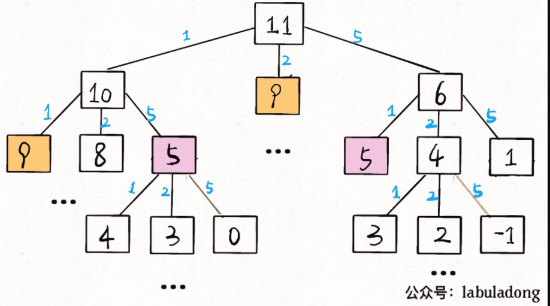

# 要确定的问题

- `子问题`相互独立，比如你想求 `amount = 11` 时的最少硬币数（原问题），如果你知道凑出 `amount = 10` 的最少硬币数（子问题），你只需要把子问题的答案加一（再选一枚面值为 1 的硬币）就是原问题的答案，因为硬币的数量是没有限制的，子问题之间没有相互制，是互相独立的。
- 确定 `状态`，有就是原问题和子问题中变化的变量。由于硬币数量无限，所以唯一的状态就是目标金额 `amount`。
- 确定 `dp` 函数的定义。当前的目标金额是n，至少需要 `dp(n)` 个硬币凑出该金额。
- 确定 `选择` 并择优。也就是对于每个状态，可以做出什么选择改变当前状态。具体到这个问题，无论当的目标金额是多少，选择就是从面额列表 `coins` 中选择一个硬币，然后目标金额就会减少

```python
#  伪代码框架
def coinChange(coins: List[int] , amout:int):
  # 定义：要凑出金额 n，至少要 dp(n) 个硬币
  def dp(n):
    # 做选择，选择需要硬币最少的那个结果
    for coin in coins:
        res = min(res , 1+dp(n-coin))
    return res  
  # 我们要求的问题是 dp(amout)
  return dp(amout)  
```

最后明确 `base case`，显然目标金额为 `0` 时，所需硬币数量为 0 ；当目标金额小于0时，无解，返回-1.

```python
def coinChange(coins: List[int] , amount: int):
    def dp(n):
        # base case
        if n == 0: return 0
        if n < 0: return -1
        # 求最小值，所以初始化为正无穷
        res = float('INF')
        for coin in coins:
            subproblem = dp(n - coin)
            # 子问题无解，跳过
            if subproblem == -1: continue
            res = min(res,1+subprolem)
        return res if res != float('INF') else -1  
    return dp(amount)  
```

至此，状态转移方程其实已经完成了，以上算法已经是暴力解法了，以上代码的数学形式就是状态转移方程：

$$
\begin{matrix}
dp(n)
\end{matrix} 
=
f(x)=\left\{
\begin{aligned}
0 , & n=0 \\
-1 , & n<0 \\
min\{dp(n-coin)+1 | coin \in coins \} , n>0
\end{aligned}
\right.

$$

至此，这个问题其实就解决了，只不过需要消除一下重叠子问题，比如 `amount = 11, coins ={1,2,5}` 时画出递归树看看：


时间复杂度分析：子问题总数 x 每个子问题的时间。
子问题总数为递归树节点个数，这个比较难看出来，是 O(n^k)，总之是指数级别的。每个子问题中含有一个 for 循环，复杂度为 O(k)。所以总时间复杂度为 O(k * n^k)，指数级别
